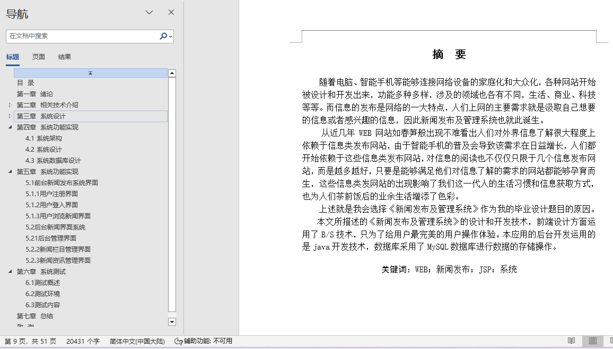
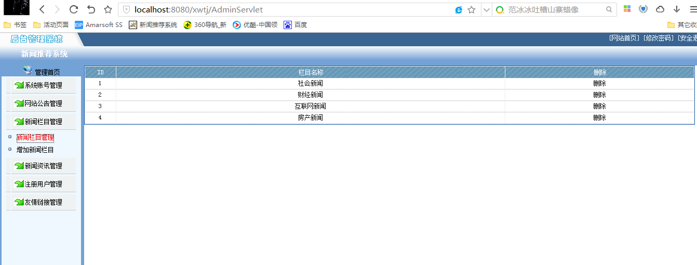
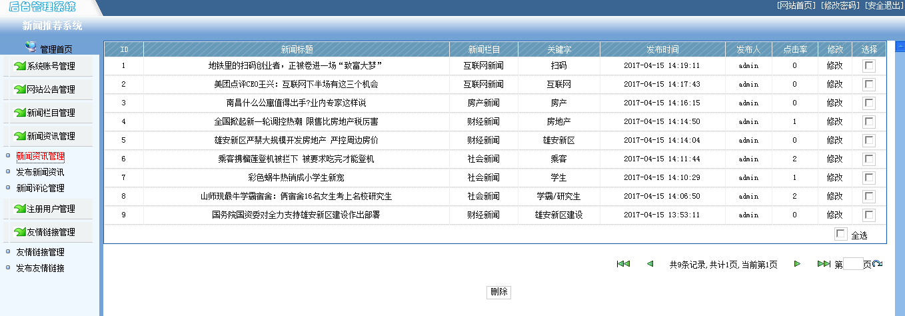
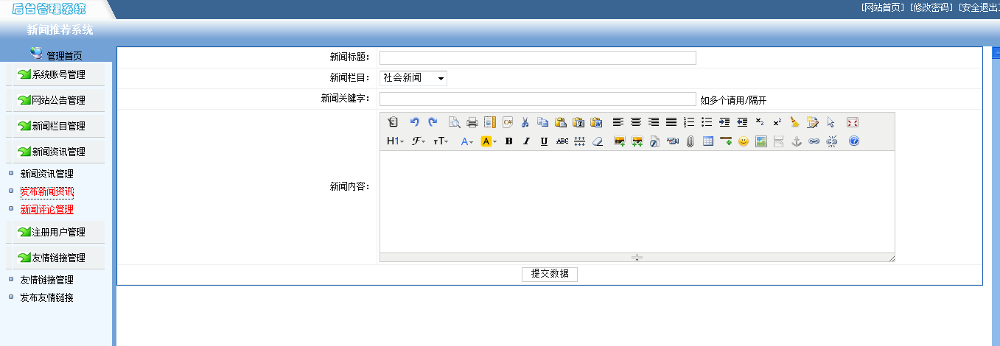
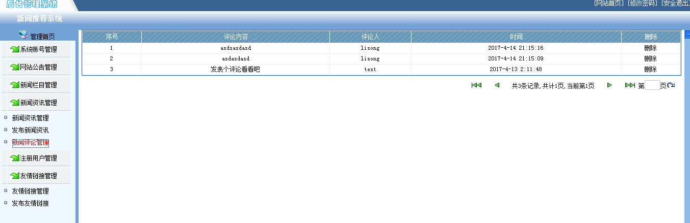
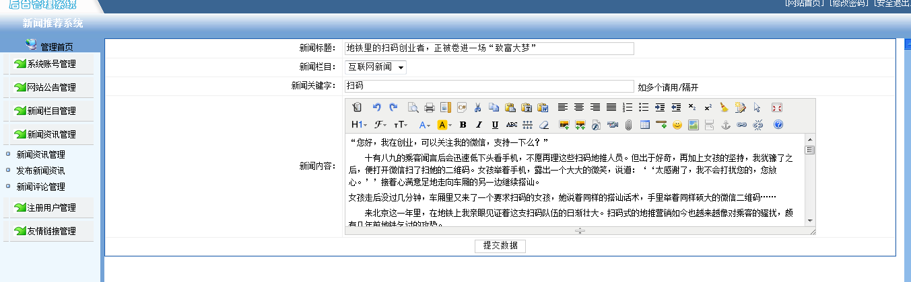
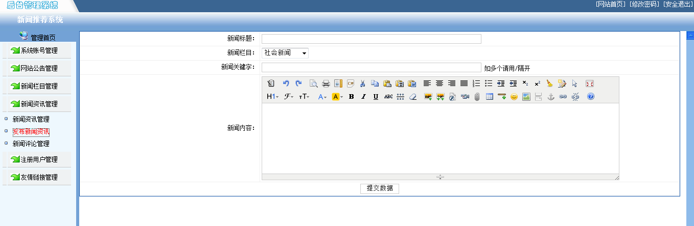
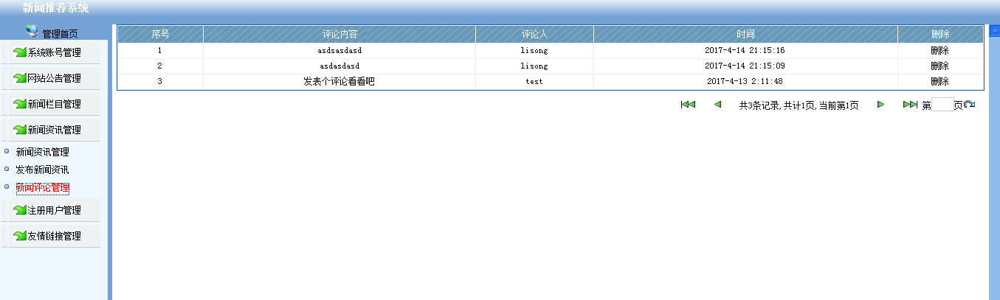

## 基于JSP+Servlet实现的新闻发布管理系统(程序+报告)

- <b>完整代码获取地址：从戎源码网 ([https://armycodes.com/](https://armycodes.com/))</b>
- <b>技术探讨、资料分享，请加QQ群：692619798</b> 
- <b>作者微信：19941326836  QQ：952045282</b> 
- <b>承接计算机毕业设计、Java毕业设计、Python毕业设计、深度学习、机器学习</b>
- <b>选题+开题报告+任务书+程序定制+安装调试+论文+答辩ppt 一条龙服务</b>
- <b>所有选题地址 ([https://github.com/YuLin-Coder/AllProjectCatalog](https://github.com/YuLin-Coder/AllProjectCatalog)) </b>

## 项目介绍
基于JSP+Servlet实现的新闻发布管理系统，主要功能如下

（1）用户管理：
	用户注册：新用户注册
	用户登录：新用户登录
	找回密码：忘记密码找回密码
	用户评论：发表对新闻的评论
（2）管理员管理：
	系统管理：
	系统账号管理：管理员管理系统现有账号，进行删除停用等操作
	系统公告管理：系统公告的发布和删除
	新闻栏目管理：新闻栏目的新增和删除
	新闻资讯管理：新闻资讯的新增和删除
	注册用户管理：注册用户的删除和冻结
	友情链接管理：添加和删除友情链接功能
	新闻评论管理：删除用户不当评论
（3）其他：
	安全退出主页面，返回登录页面。

## 项目技术
- 编程语言：Java
- 数据库：MySQL
- 前端技术：JSP、JavaScript、bootstrap、JQuery
- 后端技术：Servlet、JDBC

## 运行环境
- JDK版本：JDK1.8及以上
- 开发工具：IDEA、Ecplise、Myecplise都可以
- 数据库: MySQL5.7及以上

## 运行截图

